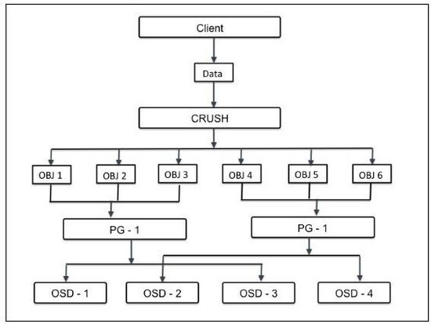

## 计算ceph osd pool pg_num 

``` txt
PG全称是placement groups，它是ceph的逻辑存储单元。

在数据存储到cesh时，先打散成一系列对象，再结合基于对象名的哈希操作、复制级别、PG数量，产生目标PG号。

根据复制级别的不同，每个PG在不同的OSD上进行复制和分发。

可以把PG想象成存储了多个对象的逻辑容器，这个容器映射到多个具体的OSD。

PG存在的意义是提高ceph存储系统的性能和扩展性。
```


### ceph 官方文档
<https://ceph.com/pgcalc/>

* 计算公式 
```txt
( Target PGs per OSD ) x ( OSD # ) x ( %Data )/( Size )

Target PGs per OSD : 
    100 预计未来不会增加OSD数量
    200 预计未来会增加OSD的数量 X 2 
    300 预计未来会增加OSD的数量 X 3

OSD # : ceph cluster OSD 的总数量
%Data : 该值表示该特定OSD集合将包含在该池中的数据的近似百分比
Size : pool 的副本数. 

```

* 《learning ceph》这本书里的计算公式也差不多：
``` txt
Total PGs = ((Total_number_of_OSD * 100) / max_replication_count) / pool_count

结算的结果往上取靠近2的N次方的值。
比如总共OSD数量是160，复制份数3，pool数量也是3，那么按上述公式计算出的结果是1777.7。
取跟它接近的2的N次方是2048，那么每个pool分配的PG数量就是2048。
```

* PGP_NUM
``` txt
在更改pool的PG数量时，需同时更改PGP的数量。

PGP是为了管理placement而存在的专门的PG，它和PG的数量应该保持一致。

如果你增加pool的pg_num，就需要同时增加pgp_num，保持它们大小一致，这样集群才能正常rebalancing。

主要有以下三点：

1、 PGP起到对PG进行归置的作用。

2、 PGP的取值应该与PG相同，在PG的值增大的同时，也要增大PGP的值以保持二者的值相同。

3、 当一个POOL的PG增大后，Ceph并不会开始进行rebalancing，只有在PGP的值增大后，PG才会开始迁移至其他的OSD上，并且开始rebalancing。

```

### 下面介绍如何修改pg_num和pgp_num。

* （1）检查rbd这个pool里已存在的PG和PGP数量：
``` bash
$ ceph osd pool get rbd pg_num
pg_num: 128
$ ceph osd pool get rbd pgp_num
pgp_num: 128
```
* （2）检查pool的复制size，执行如下命令：
``` bash
$ ceph osd dump |grep size|grep rbd
pool 2 'rbd' replicated size 3 min_size 2 crush_ruleset 0 object_hash rjenkins pg_num 128 pgp_num 128 last_change 45 flags hashpspool stripe_width 0
```
* （3）使用上述公式，根据OSD数量、复制size、pool的数量，计算出新的PG数量，假设是256.

* （4）变更rbd的pg_num和pgp_num为256：
``` bash
$ ceph osd pool set rbd pg_num 256
$ ceph osd pool set rbd pgp_num 256
```
* （5）如果有其他pool，同步调整它们的pg_num和pgp_num，以使负载更加均衡。