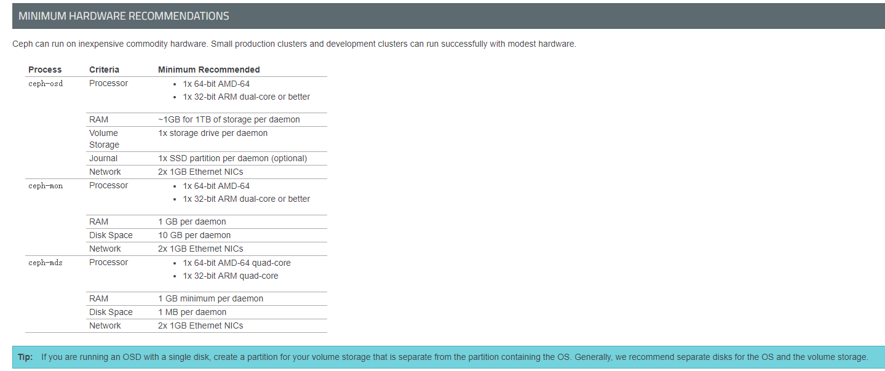
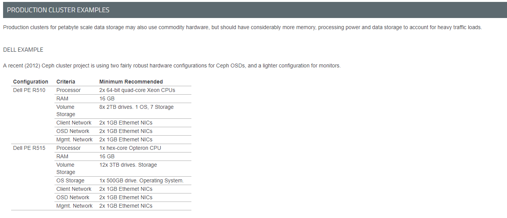

## Ceph系统架构与基本概念
``` txt
Ceph是一种为优秀的性能、可靠性和可扩展性而设计的统一的、分布式存储系统。

“统一”表示Ceph一套存储系统可以同时提供对象存储、块存储和文件系统存储三种功能，以便在满足不同应用需求的前提下简化部署和运维。

“分布式”表示Ceph系统是真正的无中心结构和没有理论上限的系统规模可扩展性，在实践当中，Ceph可以被部署于上千台服务器上。
```


### 系统架构

* Ceph的系统架构由三个层次组成：

* * 最底层也是最核心的部分是RADOS对象存储系统；
* * 第二层是librados库层；
* * 最上层对应着Ceph不同形式的存储接口实现。


```
> 最底层基于RADOS（reliable，autonomous，distributed object store），其内部包括ceph-osd后台服务进程和ceph-mon监控进程。

> 中间层librados库用于本地或者远程通过网络访问RADOS对象存储系统。

> 最上层面向应用提供3种不同的存储接口：块存储接口、对象存储接口、文件系统接口。文件系统的元数据服务器MDS用于提供元数据访问。数据直接通过librados库访问。
```
* 在ceph系统中存在两个对象概念：
```
 一个是RGW中的对象存储，一个是Ceph的后端存储的对象（后续称之为Rados对象）.
 这两个需要区分：
 前者是面向用户的，是用户接口能访问到的对象；
 后者是ceph服务端操作的对象；
```
#### Rados
```
    RADOS 主要由两种节点组成：一种是为数众多的、负责完成数据存储和维护功能的OSD（Object Storage Device），另一种则是若干个负责完成系统状态检测和维护的monitor。
```


* monitor
```
Monitor是一个独立部署的daemon进程。通过组成Monitor集群来保证自己的高可用。Monitor集群通过Paxos算法实现了自己数据的一致性。它提供了整个存储系统的节点信息等全局的配置信息。
```
* OSD

```
 OSD是负责物理存储的daemon进程，其功能存储数据，处理数据的复制、恢复、回填、再均衡，并通过检查其他OSD守护进程的心跳来向Ceph Monitors提供一些监控信息。当 Ceph 存储集群设定为有2个副本时，至少需要2个OSD守护进程，集群才能达到active+clean 状态。
```
## 基本概念
```
    在Ceph集群有这么几个基本概念：
        rados对象
        OSD
        PG
        PGP
        Pool
        file
        rbd
        rgw object
    这些基本概念组成了整个Ceph集群的逻辑架构。
```
### Rados对象
```
对象是数据存储的基本单元，一般默认4MB大小。
一个对象有三部分组成：
(1) 对象标志（ID）：唯一标识一个对象。
(2) 对象的数据：其在本地文件系统中对应一个文件，对象的数据就保存在文件中。
(3) 对象的元数据：以Key-Value（键值对）的形式，可以保存在文件对应的扩展属性中。
```
### OSD (Object Storage Device)

```
OSD是负责物理存储的进程，一般情况下，配置为和磁盘一一对应，一块磁盘启动一个OSD进程。(其详细功能可参照前述介绍)
关系说明：
/var/lib/ceph/osd/
(1) 一个OSD上可以分布多个PG
(2) OSD设备是存储rados对象的载体
```
### PG (placement group)
```
PG是OSD之上的一层逻辑，可视其为一个逻辑概念。从名字可理解PG是一个放置策略组，它是对象的集合，该集合里的所有对象都具有相同的放置策略：对象的副本都分布在相同的OSD列表上。
关系说明：
(1) PG有主从之分，对于多副本而言，一个PG的主从副本分布在不同的OSD上；
(2) 一个对象只能属于一个PG，一个PG包含很多个对象
(3) 一个PG对应于一个OSD列表，PG的所有对象对存放在对应的OSD列表上
​
这里的对象是rados object,而非用户对象
```
### pool
```
Pool是一个抽象的存储池，它是PG之上的一层逻辑
它规定了数据冗余的类型以及对应的副本分布策略。目前实现了两种pool类型：replicated类型和Erasure Code类型。
关系说明：
(1) 一个pool由多个PG构成，一个PG只能属于一个POOL
(2) 同一个Pool中的PG具有相同的类型，比如，如Pool为副本类型，则Pool中所有的PG都是多副本的
```
### PGP (Placement Group for Placemen)
```
    关于PGP的介绍并不多，《Learning Ceph》:


PGP is Placement Group for Placement purpose, which should be kept equal to the total number of placement groups (pg_num). For a Ceph pool, if you increase the number of placement groups, that is, pg_num, you should also increase pgp_num to the same integer value as pg_num so that the cluster can start rebalancing. The undercover rebalancing mechanism can be understood in the following way.The pg_num value defines the number of placement groups, which are mapped to OSDs. When pg_num is increased for any pool, every PG of this pool splits into half, but they all remain mapped to their parent OSD. Until this time, Ceph does not start rebalancing. Now, when you increase the pgp_num value for the same pool, PGs start to migrate from the parent to some other OSD, and cluster rebalancing starts. In this way, PGP plays an important role in cluster rebalancing.
其基本意思为：


1. PGP起到对PG进行归置的作用；
2. PGP的取值应该与PG相同，在PG的值增大的同时，也要增大PGP的值以保持二者的值相同；
3. 当一个POOL的PG增大后，Ceph并不会开始进行rebalancing，只有在PGP的值增大后，PG才会开始迁移至其他的OSD上，并且开始rebalancing
```
### File
```
文件是文件系统中一个概念；
ceph文件系统是基于元数据存储池和数据存储池构建的逻辑系统，文件系统中的文件会通过libcephfs及RADOS映射到对象(rados对象)，然后利用Crush计算来定位在存储设备中的位置。
```
### RBD (Rados Block Device)
```
RBD是ceph块设备；
RBD镜像是基于存储池构建的逻辑存储系统，RBD镜像通过librbd及RADOS映射到对象(rados对象)，然后利用Crush计算来定位在存储设备中的位置。
```
### Rgw Object
```
Rgw Object，泛指一个文档、图片或视频文件等，尽管用户可以直接上传一个目录，但是ceph并不按目录层级结构保存Rgw Object， 所有的Rgw Object都是扁平化
Rgw Object通过librados及RADOS映射到对象(rados对象)，然后利用Crush计算来定位在存储设备中的位置。
```


## 硬件资源需求:

### CPU资源

``` 
MDS (Metadata server )
该类型服务需要占用大量CPU计算资源.
mds 服务不应该部署在大量CPU计算型服务的服务器上, 如Nova 
```

### RAM 资源
```
MDS和MON必须能够快速提供数据，因此它们应该有足够的RAM（例如，每个守护进程实例有1GB的RAM）。 OSD对于常规操作不需要太多的RAM（例如，每个守护进程实例有500MB的RAM）;然而，在恢复期间，它们需要更多的RAM（例如，每个守护进程每1TB存储大约1GB）。一般来说，RAM越多越好。
```

### DATA Storage
```
仔细规划您的数据存储配置。在规划数据存储时需要考虑显着的成本和性能折衷。同时操作系统操作以及多个守护进程对单个驱动器的读取和写入操作的同时请求可能会显着降低性能。 重要由于Ceph必须在发送ACK（至少用于XFS）之前将所有数据写入日志，因此使日志和OSD性能保持平衡非常重要！
```

## 最低硬件建议:




## 生产环境服务器配置建议:

